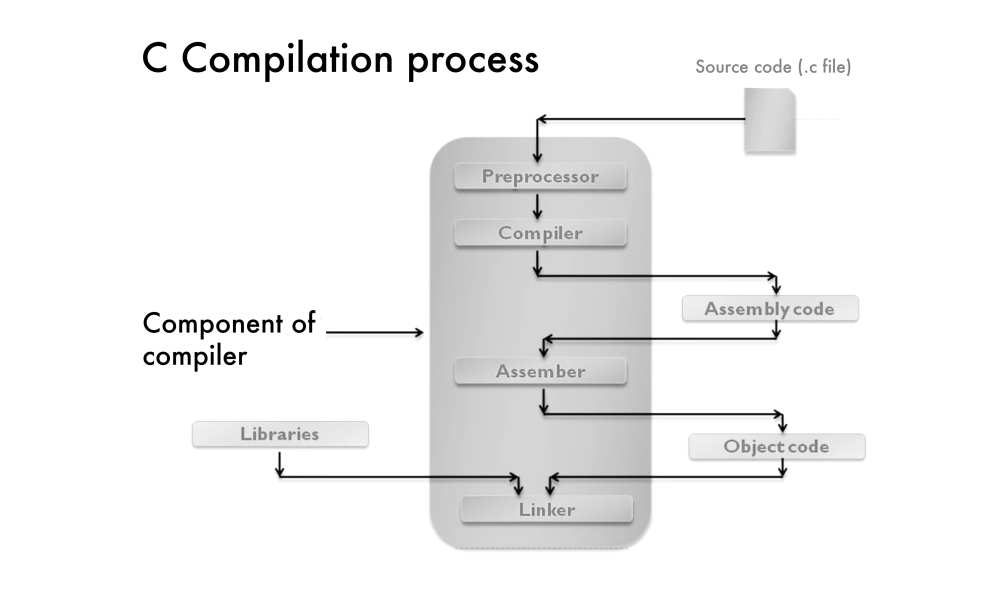

# Lab 1: Deconstructing the C Compilation Pipeline

## 1. Objective

**To analyze the transformation of C source code into an executable by isolating each phase of the GCC Toolchain: Preprocessing, Compilation, Assembly and Linking.**

---

## 2. Technical Theory

The transition from a `.c` file to a running program is a multi-stage pipeline. Each stage has a specific input and a specific output format.


- **The Preprocessor (cpp):** Manages preprocessing tasks. It replaces `#include` directives with the actual content of header files and substitutes `#define` macros with their corresponding values.

- **The Compiler (cc1):** Converts the preprocessed C source code into assembly language. This stage is responsible for performing syntax and semantic analysis.

- **The Assembler (as):** Converts assembly instructions into machine code (binary instructions).

- **The Linker (ld):** Links your program with external libraries (such as `printf` from the Standard C Library) to produce a complete executable file.

---

## 3. Lab Environment

- **OS:** Windows with MinGW
- **Compiler:** GCC (GNU Compiler Collection)
- **Text Editor:** VS Code

---

## 4. Procedure & Manual Tracing

### Step 1: Create the Source Code

Write the following code and save it as lab1.c.

```c
/*
Author: Oshan Bajracharya
Purpose: Experiment 1 for lab 1 - Find the sum of two integers 
Date: May 4, 2026
*/

#include <stdio.h>

int main() {
    int a, b, sum;

    printf("Enter two numbers: ");
    scanf("%d %d", &a, &b);

    sum = a + b;

    printf("The sum of %d and %d is: %d\n", a, b, sum);

    return 0;
}
```

### Step 2: Isolating the Phases

Run the following commands in your terminal and perform the required "Observations" for each file generated.

#### A. Preprocessing

**Command:** `gcc -E lab1.c -o lab1.i`

- Action: Open **lab1.i** in your editor.
- Observation: Note how the ***#include <stdio.h>*** has been replaced by thousands of lines of code.

#### B. Compilation (To Assembly)

**Command:** `gcc -S lab1.c -o lab1.s`

- Action: Open **lab1.s**.
- Observation: This is Assembly Language.

#### C. Assembly (To Object Code)

**Command:** `gcc -c lab1.c -o lab1.o`

- Action: Try to open **lab1.o** in a standard text editor.
- Observation: It will look like gibberish because it is binary (Machine Code).
- Advanced View: Run `nm lab1.o` in the terminal. This shows the "Symbol Table." You will see main and a reference to printf.
```output
00000000 b .bss
00000000 d .data
00000000 r .eh_frame
00000000 r .rdata
00000000 r .rdata$zzz
00000000 t .text
         U ___main
00000000 T _main
         U _printf
         U _scanf
```

#### D. Linking

**Command:** `gcc lab1.o -o lab1.exe` (or just lab1 on Linux)

- Action: Run the program with `./lab1`.

### One Command to Get All Files

```bash
gcc -save-temps <|file_name.c|> -o <|executable_name.exe|>
```

---

## 5. Try It Yourself
**Write a program to calculate area of circle by defining PI as macro constant.**

```c
/*
Author: Oshan Bajracharya
Purpose: Experiment 2 for lab 1 - Find the area of a circle
Date: May 4, 2026
*/

#include <stdio.h>

#define PI 3.14159

int main() {
    double radius, area;

    printf("Enter the radius of the circle: ");
    scanf("%lf", &radius);

    area = PI * radius * radius;

    printf("The area of the circle with radius %.2lf is: %.2lf\n", radius, area);

    return 0;
}
```

All the actions for this program were also performed one by one.

---

## Conclusion
In this lab, we successfully separated and examined each stage of the C compilation process using GCC. This practical approach helped us gain a deeper understanding of how source code is converted into an executable program.


---
