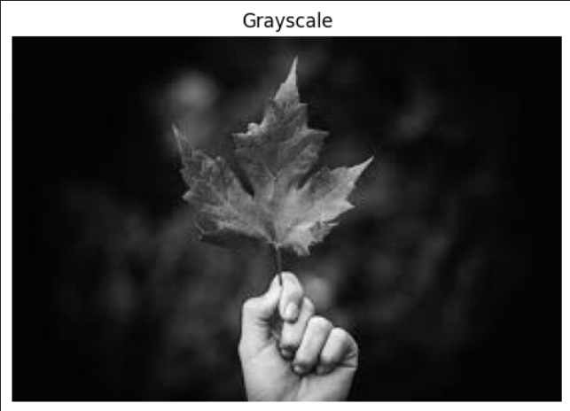
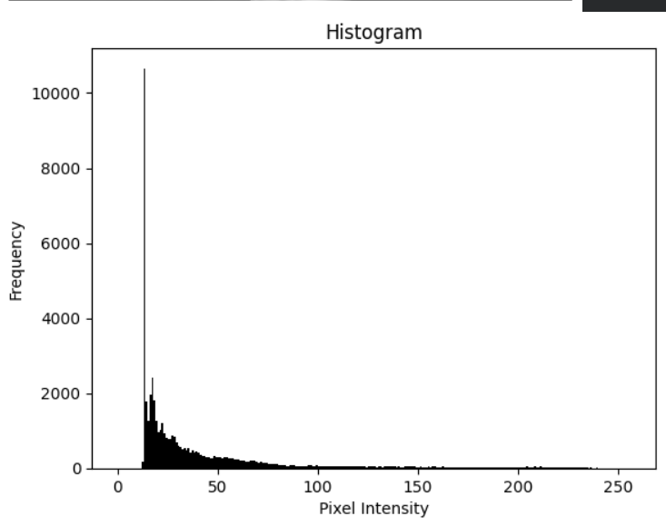
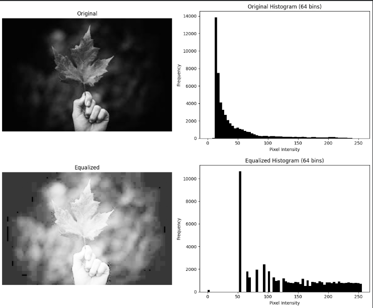
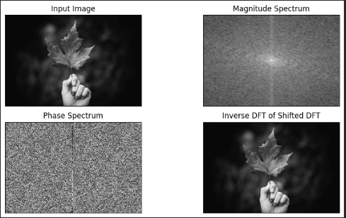
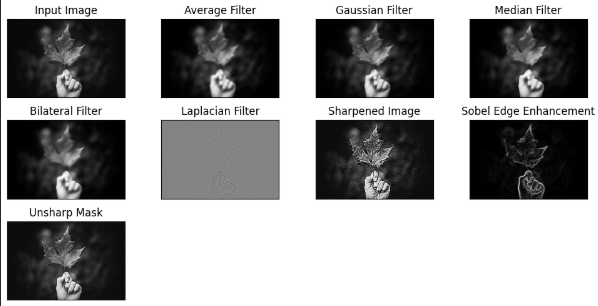

**Name:** Oshan <BR>
**Roll No:** 230328<BR>
**Faculty:** BCE<BR>
**Lab:** Python Programming — Digital Image Processing<BR>

---
# TITLE:
Image Processing — Histogram, Fourier Transform, and Filtering

# OBJECTIVE
- To understand grayscale conversion and visualize image histograms.
- To perform histogram equalization and observe its effect on image contrast.
- To compute the Fourier Transform and Inverse Fourier Transform of an image and visualize magnitude and phase spectra.
- To apply various smoothing and sharpening filters and compare their visual effects.

---

# THEORY

#### Part I: Histogram and Grayscale

A **grayscale image** represents pixel intensity values ranging from 0 (black) to 255 (white). A **histogram** shows the frequency distribution of these pixel intensity values across the image.

| Concept | Description |
|---------|-------------|
| Grayscale Conversion | Removes color information; each pixel holds a single intensity value |
| Histogram | Bar chart of pixel intensities (0–255) vs. frequency |
| `cv2.cvtColor()` | Converts color space (e.g., BGR to GRAY) |
| `plt.hist()` | Plots the histogram using pixel intensity values |

---

#### Part II: Histogram Equalization

**Histogram equalization** redistributes pixel intensities to improve the contrast of an image. It spreads out the most frequent intensity values across the full range.

| Concept | Description |
|---------|-------------|
| CDF | Cumulative Distribution Function used to remap intensities |
| `cv2.equalizeHist()` | Applies histogram equalization to a grayscale image |
| Effect | Dark images become brighter; low-contrast images gain detail |

---

#### Part III: Fourier Transform

The **Discrete Fourier Transform (DFT)** converts an image from the spatial domain to the frequency domain.

| Concept | Description |
|---------|-------------|
| `np.fft.fft2()` | Computes the 2D DFT of an image |
| `np.fft.fftshift()` | Shifts zero-frequency component to the center |
| Magnitude Spectrum | Shows the strength of frequency components |
| Phase Spectrum | Shows the phase angle of frequency components |
| `np.fft.ifft2()` | Reconstructs the image from frequency domain (Inverse DFT) |

---

#### Part IV: Smoothing and Sharpening Filters

| Filter | Type | Function |
|--------|------|----------|
| Average (Box) Filter | Smoothing | Replaces each pixel with the average of neighbors |
| Gaussian Filter | Smoothing | Weighted average; reduces noise while preserving edges |
| Median Filter | Smoothing | Replaces pixel with median of neighbors; removes salt-and-pepper noise |
| Bilateral Filter | Smoothing | Edge-preserving smoothing |
| Laplacian Filter | Sharpening | Highlights edges using second-order derivatives |
| Custom Kernel | Sharpening | Emphasizes center pixel to enhance sharpness |
| Sobel Filter | Edge Detection | Detects edges using first-order gradient in X and Y directions |
| Unsharp Mask | Sharpening | Subtracts blurred version from original to enhance edges |

---

# LAB TASK

### Task 1: Program to Obtain the Histogram

#### Code:

```python
import cv2
import matplotlib.pyplot as plt

# Read the image
I = cv2.imread('/content/image.jpg')

# Convert the image to grayscale
J = cv2.cvtColor(I, cv2.COLOR_BGR2GRAY)

# Display the grayscale image
plt.figure()
plt.imshow(J, cmap='gray')
plt.title('Grayscale')
plt.axis('off')
plt.show()

# Display the histogram
plt.figure()
plt.hist(J.ravel(), bins=256, range=[0, 256], color='black')
plt.title('Histogram')
plt.xlabel('Pixel Intensity')
plt.ylabel('Frequency')
plt.show()
```

#### Input Image:


#### Output — Grayscale Image:



#### Output — Histogram:



**Observation:**
The original color image was converted to grayscale using `cv2.COLOR_BGR2GRAY`. The histogram shows the distribution of pixel intensities across 256 bins. Peaks in the histogram represent the most dominant intensity values in the image.

---

### Task 2: Program to Perform Histogram Equalization

#### Code:

```python
import cv2
import numpy as np
import matplotlib.pyplot as plt

def compute_hist_cdf(image, bins=256):
    hist, bin_edges = np.histogram(image.flatten(), bins=bins, range=[0, bins])
    cdf = hist.cumsum()
    cdf_normalized = cdf / cdf[-1]
    return hist, cdf_normalized

# Read the image and convert to grayscale
A = cv2.imread('image.jpg')
I = cv2.cvtColor(A, cv2.COLOR_BGR2GRAY)

# Display original grayscale image and histogram (64 bins)
plt.figure(figsize=(12, 5))
plt.subplot(1, 2, 1)
plt.imshow(I, cmap='gray')
plt.title('Original')
plt.axis('off')
plt.subplot(1, 2, 2)
plt.hist(I.ravel(), bins=64, range=[0, 256], color='black')
plt.title('Original Histogram (64 bins)')
plt.xlabel('Pixel Intensity')
plt.ylabel('Frequency')
plt.tight_layout()
plt.show()

# Histogram equalization
J = cv2.equalizeHist(I)

# Display equalized image and histogram (64 bins)
plt.figure(figsize=(12, 5))
plt.subplot(1, 2, 1)
plt.imshow(J, cmap='gray')
plt.title('Equalized')
plt.axis('off')
plt.subplot(1, 2, 2)
plt.hist(J.ravel(), bins=64, range=[0, 256], color='black')
plt.title('Equalized Histogram (64 bins)')
plt.xlabel('Pixel Intensity')
plt.ylabel('Frequency')
plt.tight_layout()
plt.show()
```

#### Image:


#### Output — All Filters Applied:



**Observation:**
Before equalization, the histogram shows intensity values concentrated in a narrow range, indicating low contrast. After applying `cv2.equalizeHist()`, the histogram becomes more uniformly distributed across all intensity levels, resulting in improved contrast and visibility of image details.

---

### Task 3: Program to Compute Fourier Transform and Inverse Fourier Transform

#### Code:

```python
import numpy as np
import cv2
import matplotlib.pyplot as plt

image = cv2.imread('/content/image.jpg', cv2.IMREAD_GRAYSCALE)

# Compute DFT and shift
dft = np.fft.fft2(image)
dft_shift = np.fft.fftshift(dft)

# Compute magnitude and phase spectra
magnitude_spectrum = 20 * np.log(np.abs(dft_shift))
phase_spectrum = np.angle(dft_shift)

# Compute Inverse DFT
idft_shift_original = np.fft.ifftshift(dft_shift)
idft_original = np.fft.ifft2(idft_shift_original)
idft_original = np.abs(idft_original)

# Visualize all four
plt.figure(figsize=(10, 5))

plt.subplot(221)
plt.imshow(image, cmap='gray')
plt.title('Input Image')
plt.xticks([])
plt.yticks([])

plt.subplot(222)
plt.imshow(magnitude_spectrum, cmap='gray')
plt.title('Magnitude Spectrum')
plt.xticks([])
plt.yticks([])

plt.subplot(223)
plt.imshow(phase_spectrum, cmap='gray')
plt.title('Phase Spectrum')
plt.xticks([])
plt.yticks([])

plt.subplot(224)
plt.imshow(idft_original, cmap='gray')
plt.title('Inverse DFT of Shifted DFT')
plt.xticks([])
plt.yticks([])

plt.tight_layout()
plt.show()
```

#### Input Image:

#### Output — All Filters Applied:



**Observation:**
The magnitude spectrum shows a bright center point representing the dominant low-frequency components (background, gradual changes). The phase spectrum contains structural information about the image. The reconstructed image from Inverse DFT matches the original, confirming lossless transform and recovery.

---

### Task 4: Program to Apply Various Smoothing and Sharpening Filters

#### Code:

```python
import cv2
import numpy as np
import matplotlib.pyplot as plt

image = cv2.imread('image.jpg', cv2.IMREAD_GRAYSCALE)

plt.figure(figsize=(10, 5))

# Input image
plt.subplot(341)
plt.imshow(image, cmap='gray')
plt.title('Input Image')
plt.xticks([])
plt.yticks([])

# Smoothing Filters
avg_filter = cv2.blur(image, (5, 5))
plt.subplot(342)
plt.imshow(avg_filter, cmap='gray')
plt.title('Average Filter')
plt.xticks([])
plt.yticks([])

gaussian_filter = cv2.GaussianBlur(image, (5, 5), 0)
plt.subplot(343)
plt.imshow(gaussian_filter, cmap='gray')
plt.title('Gaussian Filter')
plt.xticks([])
plt.yticks([])

median_filter = cv2.medianBlur(image, 5)
plt.subplot(344)
plt.imshow(median_filter, cmap='gray')
plt.title('Median Filter')
plt.xticks([])
plt.yticks([])

bilateral_filter = cv2.bilateralFilter(image, 9, 75, 75)
plt.subplot(345)
plt.imshow(bilateral_filter, cmap='gray')
plt.title('Bilateral Filter')
plt.xticks([])
plt.yticks([])

# Sharpening Filters
laplacian_filter = cv2.Laplacian(image, cv2.CV_64F)
plt.subplot(346)
plt.imshow(laplacian_filter, cmap='gray')
plt.title('Laplacian Filter')
plt.xticks([])
plt.yticks([])

kernel = np.array([[-1, -1, -1], [-1, 9, -1], [-1, -1, -1]])
sharpened_image = cv2.filter2D(image, -1, kernel)
plt.subplot(347)
plt.imshow(sharpened_image, cmap='gray')
plt.title('Sharpened Image')
plt.xticks([])
plt.yticks([])

sobel_x = cv2.Sobel(image, cv2.CV_64F, 1, 0, ksize=5)
sobel_y = cv2.Sobel(image, cv2.CV_64F, 0, 1, ksize=5)
sobel_edge = cv2.magnitude(sobel_x, sobel_y)
plt.subplot(348)
plt.imshow(sobel_edge, cmap='gray')
plt.title('Sobel Edge Enhancement')
plt.xticks([])
plt.yticks([])

gaussian_blur = cv2.GaussianBlur(image, (5, 5), 0)
unsharp_mask = cv2.addWeighted(image, 2, gaussian_blur, -1, 0)
plt.subplot(349)
plt.imshow(unsharp_mask, cmap='gray')
plt.title('Unsharp Mask')
plt.xticks([])
plt.yticks([])

plt.tight_layout()
plt.show()
```

#### Input Image:


#### Output — All Filters Applied:



**Observation:**

| Filter | Effect Observed |
|--------|----------------|
| Average Filter | Blurs the image uniformly; reduces sharp edges |
| Gaussian Filter | Smoother blur than average; reduces noise more naturally |
| Median Filter | Removes isolated noise pixels while preserving edges |
| Bilateral Filter | Smooths uniform regions while keeping edges sharp |
| Laplacian Filter | Highlights rapid intensity changes (edges); background becomes dark |
| Sharpened Image | Enhances edges and fine details using a custom kernel |
| Sobel Edge Enhancement | Detects edges in X and Y directions; highlights contours |
| Unsharp Mask | Enhances overall sharpness by boosting high-frequency content |

---

## CONCLUSION

In this lab, fundamental image processing operations were successfully performed using the OpenCV and Matplotlib libraries in Python. The grayscale conversion and histogram plotting provided insight into pixel intensity distribution. Histogram equalization demonstrated an effective method for improving image contrast. The Fourier Transform experiment confirmed the ability to analyze images in the frequency domain and reconstruct them accurately using the Inverse DFT. Finally, applying various smoothing and sharpening filters illustrated how spatial filtering techniques modify image quality for different purposes. Smoothing filters reduced noise while sharpening filters enhanced edges and structural details.

